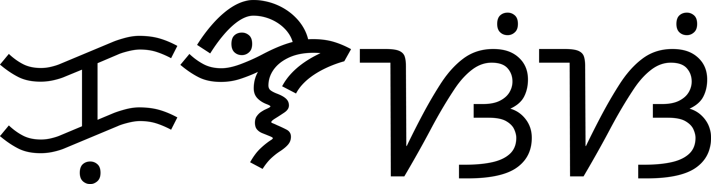

  <picture>
    <source media="(prefers-color-scheme: dark)" srcset="readme_preview/kulasisi-wordmark_dark.png" width="150">
    <source media="(prefers-color-scheme: light)" srcset="readme_preview/kulasisi-wordmark_light.png" width="150">
    
  </picture>

  <b>Kulasisi</b> is a web application that helps communities preserve and revitalize their languages 
  by offering an interactive platform where they can easily contribute content in their native languages.

  <picture>
    <source media="(prefers-color-scheme: dark)" srcset="readme_preview/mockup_login-page_dark.png" width="500">
    <source media="(prefers-color-scheme: light)" srcset="readme_preview/mockup_login-page_light.png" width="500">
    
  </picture>

## About

The Kulasisi project is designed to make it simple for communities to contribute and share content in their native languages. Its goal is to help languages with low digital presence by allowing users to add phrases, vocabulary, literary works, and more. Whether it's contributing new words, translating phrases, or sharing stories, Kulasisi gives users a way to engage with their language digitally and help grow its presence on the web.

## Tech Stack

- **Frontend**: [Next.js](https://nextjs.org/docs)
- **Backend**: [Django REST Framework](https://www.django-rest-framework.org/)

## Installation

For installation details, please refer to [INSTALL.md](INSTALL.md).

## Contributing

For contributing details, please refer to [CONTRIBUTING.md](CONTRIBUTING.md).

## Getting Involved

This project belongs to the open-source community named [Miagao Valley](https://miagaovalley.site/). We have interesting projects you might want to check out. Visit our [community](https://discord.gg/kzAKWghs)!

  

  Miagao Valley

